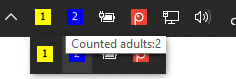
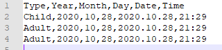
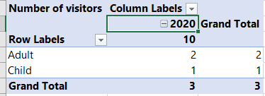
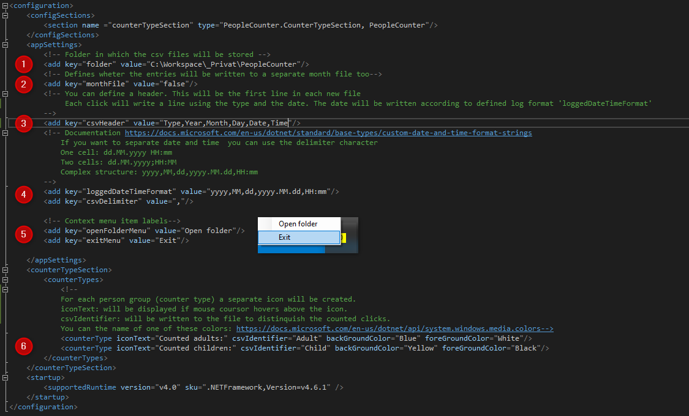
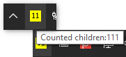
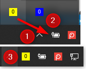

# Short Description <!-- omit in toc -->
This program adds clickable notification icons which counts the number on clicks. It can be used to count grownups and children or any other group which has been configured. 

For each click a new line will be written to a csv file.

Afterwards you can use a program like excel to get an overview of your counts.

### Deutsche Dokumentation <!-- omit in toc -->
Es gibt eine [Dokumentation](Besucherzähler.docx) in deutsch.

### Download  <!-- omit in toc -->
Releases with a configuration for english and german can be found [here](https://github.com/Daniel-Krueger/PeopleCounter/releases)

# Table of contents  <!-- omit in toc -->
- [1. Setup and configuration](#1-setup-and-configuration)
  - [1.1. Installation](#11-installation)
  - [1.2. Configuration](#12-configuration)
  - [1.3. Autostart](#13-autostart)
- [2. Remarks](#2-remarks)
  - [2.1. Program does not start](#21-program-does-not-start)
  - [2.2. File is locked](#22-file-is-locked)
  - [2.3. Counter doesn't count](#23-counter-doesnt-count)
  - [2.4. Notification icon is missing although the program is executed](#24-notification-icon-is-missing-although-the-program-is-executed)
  - [2.5. Updating the program](#25-updating-the-program)

# 1. Setup and configuration
## 1.1. Installation
The program consist of a simple .exe file. Just run it, if you want to start counting. 

## 1.2. Configuration
Besides the program there's a 'PeopleCounter.exe.config'. Here you can change a few elements. You need to restart the program after changing any setting.
1. Folder in which the csv file will be written. 
  
**Warning:** It's necessary that the current user has write permissions to this location. If the folder doesn't exist it should be created automatically.
2. By default all clicks will be written to a csv file for the current year. Setting this value to 'true' will cause to write the click to a month file, too. 

3. If the csv file for the current month does not exist yet, it will be created and this header will be written to it. 

**Warning:**  Make sure to use the same csv delimiter as defined below.

4. Once a user clicks on the icon the current time will be written to the csv file. The time will be written in the defined format. Since this is a csv file, you can decide whether you want to have:
   - A single column with date and time
   - Two columns with date and time
   - Any other format, just use the csv delimiter in the format.
   - 
5. You can define different labels for the context menu items. 

6. Here you can define a number of groups you want to count. The intention of the default configuration is to count children and adults separately.

**Info:** There's also an 'PeopleCounter.exe.deutsch.config' with some predefined settings in german. If you want to use these, just replace the 'PeopleCounter.exe.config' with the other one.

## 1.3. Autostart
The .zip file contains a .bat file which creates a shortcut to the program and places this in the startup folder. Once it's placed in the startup folder the program will automatically be started with windows.

**Warning:**  You need administrator privileges for executing the batch file.

An alternative way is:
1. Create a shortcut for the program
2. Open the startup folder in the explorer 
3. Copy the following into the address bar
``
%userprofile%\AppData\Roaming\Microsoft\Windows\Start Menu\Programs\Startup
``
4. Place the shortcut in the startup folder

# 2. Remarks
## 2.1. Program does not start
The program wants to lock the csv file for write access. If the csv file is already opened you can not start it.

## 2.2. File is locked
While the program is executed the file is locked for write access. You can still open it in read mode. 

## 2.3. Counter doesn't count
The notification icons have a fixed width. Therefore the counter can display only the first to digits of the total count. If you want to see the correct number, just hover above the icon.

## 2.4. Notification icon is missing although the program is executed
By default Windows hides some notification icons. You can easily tell Windows to always show specific icons:
1. Click on the top arrow to show all notification icons
2. Select the icon
3. Drag and drop it to the area
   

## 2.5. Updating the program
In some circumstances an update to the program will cause windows to forget the settings whether the icons should be displayed in the notification area or not. Just repeat the above step.